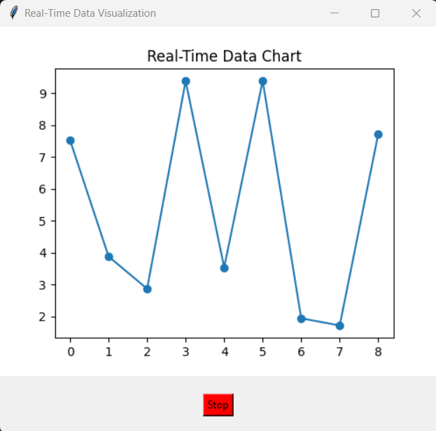

# Real-Time Data Visualization with Tkinter and SQLite

This project demonstrates real-time data visualization using Tkinter for the user interface, SQLite for data storage, and Matplotlib for plotting.





## Project Structure

The project is organized with the following structure:

- **src/**
  - **chart/**
    - `realtime_chart.py`: Contains the `RealTimeChart` class for real-time data visualization.
  - **ui/**
    - `main_window.py`: Contains the `RealTimeDataApp` class 


## Dependencies

- `tkinter`: GUI toolkit for Python.
- `matplotlib`: Plotting library for Python.
- `numpy`: Numerical computing library for Python.

Install the dependencies using the following command:

```bash
pip install matplotlib numpy

